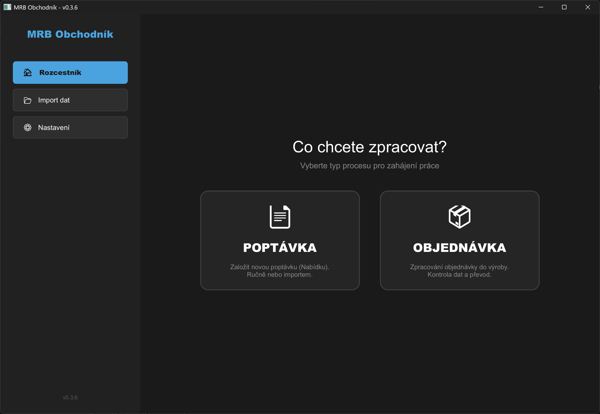

# MRB Obchodník 🚀


**MRB Obchodník** je moderní desktopová aplikace pro správu a synchronizaci databáze obchodních partnerů. Je navržena pro efektivní import dat z Excelu, jejich párování s lokální databází a správu cest k dokumentaci.

## 📸 Náhled aplikace


## 🌟 Klíčové vlastnosti

- **Rychlý import dat:** Využívá sílu Rustu a knihovny `calamine` pro bleskové načtení velkých Excel souborů (.xlsx, .xlsm).
- **Chytrá synchronizace:** - Automaticky detekuje nové partnery podle ID.
  - Aktualizuje názvy a časy u existujících záznamů.
  - **Zachovává cesty ke složkám** (uživatelská data se nepřepisují).
- **Moderní UI:** Postaveno na frameworku **Slint**.
  - Tmavý režim (Dark Mode).
  - Responzivní layout.
  - Samostatné vyskakovací okno s průběhem importu (Progress Bar).
- **Multithreading:** Import běží na pozadí, takže aplikace nezamrzá a zůstává plynulá.
- **Persistentní nastavení:** Aplikace si pamatuje cesty k archivu a výrobě (JSON konfigurace).

## 🛠️ Použité technologie

- **Jazyk:** [Rust](https://www.rust-lang.org/) 🦀
- **GUI:** [Slint](https://slint.dev/)
- **Data:**
  - `serde` & `serde_json` (Práce s JSON)
  - `calamine` (Čtení Excelu)
  - `chrono` (Práce s časem)
  - `rfd` (Nativní souborové dialogy)

## 🚀 Jak spustit projekt

### Prerekvizity
- Nainstalovaný **Rust** a **Cargo**.
- Nainstalovaný **Git**.
- VS Code (doporučeno) s rozšířením *Slint*.

### Instalace a spuštění

1. **Klonování repozitáře:**
   ```bash
   git clone [https://github.com/TVUJ-UZIVATEL/mrb-obchodnik.git](https://github.com/TVUJ-UZIVATEL/mrb-obchodnik.git)
   cd mrb-obchodnik